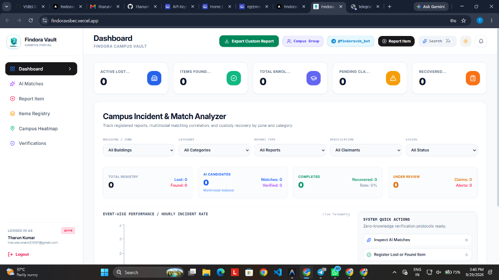
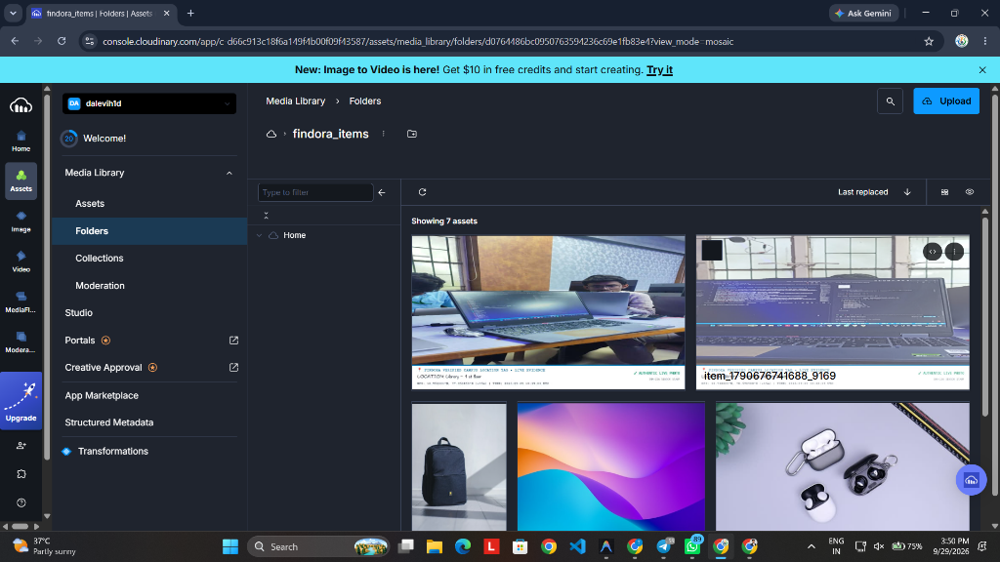
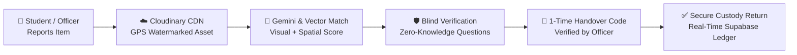

# 🛡️ FINDORA AI
### Autonomous Campus Lost & Found Intelligence Network

<div align="center">

[](https://findoravsbec.vercel.app)
[](https://supabase.com)
[](https://cloudinary.com)
[](https://deepmind.google/technologies/gemini/)
[](https://t.me/findoravsb_bot)

<p align="center">
  <b>Find the connection. Verify the owner. Recover it safely.</b><br/>
  An institutional-grade, privacy-first Lost & Found ecosystem built for smart campuses.
</p>

</div>

---

## 🌟 Visual Showcase

<div align="center">

### 📊 Real-Time Incident & Match Analyzer

*Live campus spatial telemetry, AI candidate matches, zone heatmaps, and zero-knowledge verification protocols.*

<br/>

### ☁️ Cloudinary Verified CDN Media Storage

*Authentic live camera captures automatically tagged with GPS coordinates, campus location stamps, and tamper-proof evidence watermarks in Cloudinary `findora_items`.*

</div>

---

## ⚡ Why FINDORA AI?

Traditional lost-and-found operations fail due to low recovery rates (< 18%), rampant identity fraud, and privacy leaks. FINDORA AI solves this with four core innovations:

| Innovation | How It Works | Campus Impact |
| :--- | :--- | :--- |
| **📸 Live Optical Evidence** | Browser camera captures with immutable GPS & timestamp watermarks saved directly to Cloudinary CDN. | Prevents fake/re-uploaded web images. |
| **🧠 Multimodal AI Matching** | Combines Google Gemini 2.5 Flash, semantic embeddings, visual feature matching, and spatio-temporal decay. | Instant matching with mathematical precision score. |
| **🛡️ Blind Verification Shield** | Generates dynamic challenge questions from private item attributes never shown to the public. | Eliminates fraudulent claimant impersonation. |
| **🤖 Telegram Instant Broadcast** | Real-time notifications and campus group broadcasts via `@findoravsb_bot`. | Sub-second campus-wide reach to students and staff. |

---

## 🏗️ System Workflow



---

## 🚀 Key Features

- **🎯 Precision Scoring Formula**:
  $$\text{Score} = 0.35 \cdot S_{\text{visual}} + 0.30 \cdot S_{\text{semantic}} + 0.15 \cdot S_{\text{category}} + 0.10 \cdot S_{\text{spatial}} + 0.10 \cdot S_{\text{temporal}}$$
- **🗺️ Campus Spatial Heatmap**: Live loss hot-spots across Library, Academic Blocks, Tech Labs, and Cafeteria.
- **👮 Three-Tier Role Access Control**:
  - **Student / User**: Report loss/found, answer blind questions, track claims.
  - **Verification Officer**: Audit custody handovers, evaluate anomalies, execute code verification.
  - **Administrator**: Institutional analytics, fraud risk mitigation, full audit telemetry.
- **🔄 Universal Real-Time Database**: Native PostgreSQL connection pooling on Supabase with zero-latency synchronization across all devices.

---

## 🛠️ Tech Stack

- **Frontend**: React 19, Vite, Tailwind CSS, Lucide Icons, Recharts
- **Backend**: Node.js, Express.js, JWT, Multer
- **Database**: Supabase PostgreSQL (`pg` connection pool with SSL)
- **Cloud Media**: Cloudinary SDK (v2)
- **AI / Multimodal**: Google Gemini 2.5 Flash API
- **Alerts & Bot**: Telegram Bot API (`node-telegram-bot-api`), Brevo SMTP Email

---

## ⚡ Quick Start

### 1. Clone & Install
```bash
git clone https://github.com/VSBECIT/findora-ai.git
cd findora-ai
npm run install:all
```

### 2. Configure `.env`
Create `.env` in the root directory:
```env
PORT=5000
DATABASE_URL=postgresql://postgres:[PASSWORD]@[HOST]:6543/postgres
CLOUDINARY_CLOUD_NAME=dalevih1d
CLOUDINARY_API_KEY=315998851513196
CLOUDINARY_API_SECRET=your_secret
GEMINI_API_KEY=your_gemini_key
TELEGRAM_BOT_TOKEN=your_bot_token
JWT_SECRET=findora_jwt_secret_key
```

### 3. Run Locally
```bash
npm run dev
```
Open [http://localhost:5173](http://localhost:5173) in your browser.

---

## 🌐 Live Deployments & Demos

- **Production Portal**: [https://findoravsbec.vercel.app](https://findoravsbec.vercel.app)
- **Telegram Bot**: [@findoravsb_bot](https://t.me/findoravsb_bot)
- **Default Officer Passcode**: `FindoraAdmin2026!`

---

<div align="center">
  <sub>Developed for Smart Campus Hackathon • VSBEC • FINDORA AI Team</sub>
</div>
